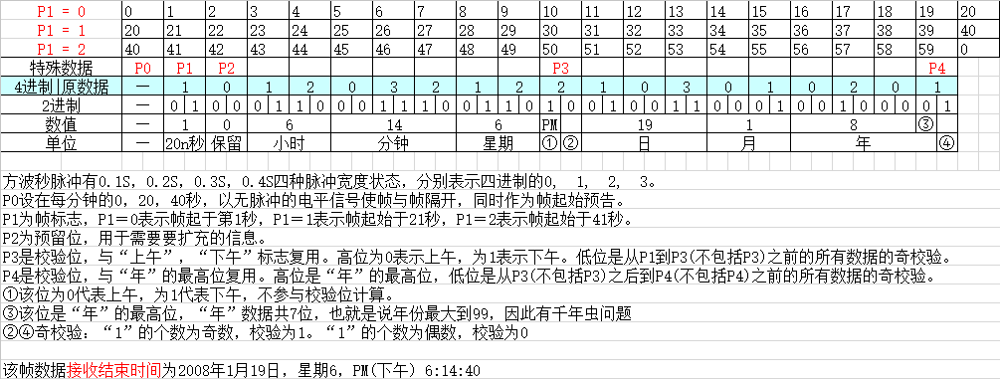

# web-bpc

本程序基于 [JJY模拟器网页版]（http://shogo82148.github.io/web-jjy/）

网络BPC使用浏览器发送BPC电波，允许BPC电波电波钟的时间对准。

##如何使用

首先确保计算机时间准确，然后访问  [BPC WEB](http://202.141.176.2/web-bpc/) 
天线（通常是足够耳机）到耳机插孔的个人计算机，并且连接到位在无线电时钟的附近。
要最大化音量并按“开始”按钮，信号将被传输。让我们将无线电时钟设置为强制接收模式并等待设置时间。

##免责声明

对于因使用造成的任何损害，我们概不负责。

##原则

BPC无线电波是68.5kHz电波，本程序发出17.125kHZ方波，方波的四次频率为68.5kHZ电波。
。
请参考[免费软件无线电时钟页面JJY模拟器（http://www.starstonesoft.com/jjy_simulator.htm）了解更多信息。

##许可证

它提供了MIT许可证。请参阅[LICENSE.md（https://github.com/shogo82148/web-jjy/blob/gh-pages/LICENSE.md）。

##相关链接

- [shogo82148 / Web的JJY]（https://github.com/shogo82148/web-jjy）
- [通过使用Web浏览器尝试了无线电波（https://shogo82148.github.io/blog/2016/03/29/web-jjy/）
- [网络JJY现在有夏令时的支持（https://shogo82148.github.io/blog/2018/08/11/web-jjy-summer-time-support/）

